# PRD — Operator Learning Assistant (Stage 1: Core Learning Loop)

## 1. Summary
Build the core loop of an agentic AI assistant that **learns the behavioural patterns of a manufacturing shopfloor operator over repeated interactions** and uses the evolving profile to personalize its responses. This PRD covers **Stage 1 only**: the deterministic learning loop backed by free-text memory in SQLite, driven by a simulated operator persona. The knowledge graph, novel-pattern reflection, full evaluation harness, and UI are explicitly deferred to later stages (see §11).

This is a take-home demo, not a production system. Optimize for clarity, explicit assumptions, and testability over features or scale.

## 2. Context
A manufacturing company wants an assistant that gradually learns how each operator works — preferred instruction modality, escalation behaviour, troubleshooting habits, shift patterns, learning needs, and confidence with different machine/process issues. These traits must be **inferred and validated over many interactions**, not captured from a single conversation. The assignment is judged on solution-design thinking, trade-offs, and feasibility testing.

## 3. Goal of Stage 1
A runnable demo that, given a scripted stream of operator interactions from a simulated persona, visibly:
1. Ingests repeated interactions/events.
2. Extracts behavioural signals from each interaction.
3. Updates a free-text operator profile over time (add / reinforce / supersede memory items).
4. Assigns a **count-based confidence tier** to each inferred pattern.
5. Uses the evolving profile to **personalize** responses, with caution on low-confidence items.

## 4. Architecture Overview

The learning ("slow") loop is a **deterministic workflow**, not a multi-agent orchestration. It is composed of small, specialized, individually-typed LLM agents wired together by ordinary code in `pipeline.py`. There is **no lead/orchestrator agent**.

```mermaid
flowchart LR
    P[Persona simulator<br/>hidden ground-truth traits] -->|interaction| ING[Ingest -> events log]
    ING --> EX[Extractor agent<br/>interaction -> signals]
    EX --> MM[Memory Manager agent<br/>signals + current memory -> operations]
    MM --> APP[Apply ops -> append-only memory log]
    APP --> TIER[Tier rule code<br/>evidence_count -> tier]
    TIER --> PROF[(Derived profile<br/>= fold of memory log)]
    PROF --> REND[Render profile -> prompt block + directive]
    REND --> RESP[Responder agent<br/>personalized reply]
```



- **Storage = SQLite**, append-only. The current profile is a *fold* over an append-only memory-operation log (event sourcing), not a mutated row. Append-only is chosen to support audit/replay and future time-decay of stale beliefs.
- **Profile = free-text memory.** Each belief is a short natural-language statement (a "memory item") wrapped in structured metadata — **not** a single prose blob, and **not** a Beta-Binomial structured profile in this stage.

## 5. Tech Stack
- **Python 3.11+**
- **Pydantic AI** for agents; **Pydantic v2** for all schemas.
- **SQLite** (stdlib `sqlite3` or `sqlmodel`) for the event + memory-operation logs.
- **LLM: an open-source hosted model** (e.g. a current Llama or Qwen instruct model) via an **OpenAI-compatible provider** (Groq / Together / Fireworks / OpenRouter). Model name, base URL, and API key come from **environment variables** — never hardcoded.
- `numpy` only if needed; no heavy ML deps in this stage.
- Dev: `ruff`, `mypy`, `pytest`.

## 6. Data Models (Pydantic)

```
OperatorInteraction        # one raw event (append-only)
  id: str
  operator_id: str
  timestamp: datetime
  shift: Literal["day","night"] | None
  event_type: str                 # e.g. "alarm", "question", "task"
  alarm_code: str | None           # captured even in stage 1, for future KG attach
  raw_text: str                    # free-text description of what happened
  outcome: str | None              # e.g. "resolved_independently", "escalated"

BehaviouralSignal          # extractor output (structured)
  category: TraitCategory          # enum below
  observation: str                 # short NL description of the signal
  value: str                       # normalized value, e.g. "VISUAL", "ESCALATED_FAST"
  source_event_id: str

TraitCategory = Enum:
  INSTRUCTION_MODALITY | ESCALATION | TROUBLESHOOTING |
  SHIFT_PATTERN | LEARNING_NEED | ISSUE_CONFIDENCE

MemoryOperation            # append-only log entry (the source of truth)
  id: str
  operator_id: str
  op_type: Literal["ADD","REINFORCE","SUPERSEDE","NOOP"]
  target_item_id: str | None       # for REINFORCE / SUPERSEDE
  text: str | None                 # for ADD / SUPERSEDE (the new belief)
  category: TraitCategory | None
  source_event_id: str
  timestamp: datetime

MemoryItem                 # derived by folding the operation log (not stored directly)
  id: str
  operator_id: str
  text: str
  category: TraitCategory
  status: Literal["tentative","established","confirmed","superseded"]
  evidence_count: int
  source_event_ids: list[str]
  created_at: datetime
  last_reinforced_at: datetime
  superseded_by: str | None

OperatorProfile            # derived view
  operator_id: str
  active_items: list[MemoryItem]   # status != superseded
```

## 7. Components / Requirements

### 7.1 Storage (`memory/store.py`)
- Two append-only SQLite tables: `events` and `memory_operations`.
- `append_event(interaction)` and `append_operation(op)` — inserts only, never updates/deletes.
- `get_profile(operator_id) -> OperatorProfile` — **folds** the operation log into the current active memory set, deriving `evidence_count`, `status`, timestamps, and `superseded_by` from the operations. The fold must be deterministic and the profile fully reconstructable from the log alone.

### 7.2 Tier rule (`memory/tiers.py`)
- Pure function `assign_status(evidence_count, confirmed: bool) -> status`.
- Thresholds in `config.py` (defaults: `tentative` if count < 3; `established` if count >= 3; `confirmed` if operator-validated flag set).
- **The tier is set by this code rule, never by the LLM.** Unit-tested, no LLM/network.

### 7.3 Provider (`agents/provider.py`)
- Configure a Pydantic AI model from env vars (`MODEL_NAME`, `MODEL_BASE_URL`, `MODEL_API_KEY`) using the OpenAI-compatible interface. One place; all agents import from here.

### 7.4 Extractor agent (`agents/extractor.py`)
- Input: one `OperatorInteraction`. Output (structured): `list[BehaviouralSignal]`.
- Use Pydantic AI structured output with retry on schema failure. Keep the prompt small.

### 7.5 Memory Manager agent (`agents/memory_manager.py`)
- Input: the new `list[BehaviouralSignal]` + the operator's current active `MemoryItem`s.
- Output (structured): `list[MemoryOperation]` choosing per signal among ADD / REINFORCE / SUPERSEDE / NOOP.
  - ADD: belief not yet captured.
  - REINFORCE: signal confirms an existing item.
  - SUPERSEDE: signal contradicts an existing item — mark old superseded, add new (never hard-delete).
  - NOOP: nothing salient.
- This is the free-text analog of a belief update. It does **not** set tiers (the code rule does).

### 7.6 Personalization render (`personalization/render.py`)
- `render_profile(profile) -> str`: produce a tagged prompt block from active items, e.g.
  `- [established] Prefers visual, step-by-step instructions`
  `- [tentative]   May need support on hydraulics faults — limited evidence, confirm if relevant`
- `derive_directive(profile, situation) -> str`: a short code-derived instruction (modality, scaffolding level, escalation posture).
- **Confidence-gated and asymmetric toward support:** reduce scaffolding/verbosity only for `established`/`confirmed` items; default to fuller support and explicit confirmation for `tentative` items.

### 7.7 Responder agent (`agents/responder.py`)
- Input: the rendered profile block + directive + the current interaction.
- Output: a personalized natural-language response. The **policy layer owns the decision (directive); the LLM owns the wording.**

### 7.8 Pipeline (`pipeline.py`)
- `process_interaction(interaction)`: ingest → extract → manage memory → apply ops → (response path) render → respond. The only orchestration point. Deterministic control flow. This is the seam where Stage-2 KG projection will later hook in.

### 7.9 Persona simulator (`sim/persona.py`)
- An LLM-simulated operator with **hidden ground-truth traits** (e.g. prefers visual; confident on basic alarms; escalates complex faults). Emits a sequence of `OperatorInteraction`s consistent with those traits, including at least one trait that **changes partway through** (to exercise SUPERSEDE / drift).
- Ground-truth traits are not visible to the rest of the system; they are the seed of the Stage-3 evaluation harness.

### 7.10 Demo driver (`scripts/demo.py`)
- Run a persona for N interactions, calling `process_interaction` each time, and print after each step: the operation(s) applied, the evolving profile with tiers, and the personalized response. Make the learning visible.

## 8. Non-Negotiable Design Constraints
1. **Confidence tier = code rule on `evidence_count`, never LLM self-rating.**
2. **Append-only; supersede, never hard-delete.** Profile must be reconstructable by folding the log.
3. **Free-text memory as atomic items with a metadata wrapper** — not a single prose blob.
4. **Deterministic orchestration in `pipeline.py`; specialized typed agents; no lead/orchestrator agent.**
5. **`tentative` / insufficient-evidence is a first-class state** and must surface caution in the prompt (assistant confirms rather than assumes).
6. **Personalization is confidence-gated and asymmetric toward support.**
7. **Provenance:** every memory item references the `source_event_id`s that produced it.
8. **Model configured via env vars; no hardcoded keys; provider must be OpenAI-compatible.**
9. **Pure logic (tiers, fold) is dependency-free and unit-tested** without network/API.

## 9. Project Structure
```
operator-learning-assistant/
├── CLAUDE.md                  # standing project memory (see §12)
├── README.md                  # what it is + how to run the demo
├── pyproject.toml
├── .env.example               # MODEL_NAME, MODEL_BASE_URL, MODEL_API_KEY
├── src/ola/
│   ├── domain/
│   │   ├── events.py          # OperatorInteraction
│   │   ├── signals.py         # BehaviouralSignal, TraitCategory
│   │   └── memory.py          # MemoryItem, MemoryOperation, OperatorProfile
│   ├── memory/
│   │   ├── store.py           # append-only SQLite + fold -> profile
│   │   └── tiers.py           # pure tier rule
│   ├── agents/
│   │   ├── provider.py
│   │   ├── extractor.py
│   │   ├── memory_manager.py
│   │   └── responder.py
│   ├── personalization/
│   │   └── render.py
│   ├── pipeline.py
│   └── config.py
├── sim/
│   └── persona.py
├── scripts/
│   └── demo.py
└── tests/
    ├── test_store.py          # append-only + fold correctness, replay
    └── test_tiers.py          # tier rule (pure, fast)
```

## 10. Acceptance Criteria (Stage 1 "done")
- `scripts/demo.py` runs against a real open-source hosted model and feeds a multi-interaction persona session.
- Across the session, the printed output shows: items being **ADDed**, **REINFORCEd** (rising `evidence_count`), at least one **tier transition** (`tentative` → `established`), and at least one **SUPERSEDE** on a contradicted/changed trait.
- Responses differ visibly between **early** (sparse/tentative profile → cautious, asks to confirm) and **later** (established profile → personalized, e.g. visual + terse).
- The full profile can be **rebuilt from the operation log alone** (a test asserts fold determinism / replay equality).
- `assign_status` and the fold are covered by fast, network-free unit tests.
- `ruff` and `mypy` pass.

## 11. Out of Scope (later stages)
- **Stage 2 — Knowledge graph (Neo4j via Docker):** domain ontology (machines, alarms, procedures, skills) + projection of `established`/`confirmed` memory items as operator→entity edges; confidence transfer across related alarms; cross-operator relationship queries. Stage 1 must not block this: capture `alarm_code` on events and keep `pipeline.py` as the projection seam.
- **Stage 3 — Evaluation harness:** precision/recall of inferred memories vs the persona's hidden ground-truth traits; LLM-as-judge for personalization quality; A/B personalized vs non-personalized.
- **Reflection organ** for discovering *unanticipated* patterns (proposes hypotheses that must earn confidence before entering the profile).
- **Recency decay / drift weighting** on the fold (the append-only log already enables it).
- **Active validation UX** beyond the in-prompt "confirm if relevant" cue.

## 12. Notes & Assumptions
- **Reconcile with `CLAUDE.md`:** if an earlier `CLAUDE.md` draft specifies Beta-Binomial confidence, update it — Stage 1 uses **free-text memory with count-based tiers**, not a Beta-Binomial structured profile. The confidence *philosophy* (counted not hallucinated, cold-start humility) is unchanged; only the mechanism is lighter.
- Mock/simulated data only; no real manufacturing data.
- Known limitations to document in the README: contradiction handling is LLM judgment (can be inconsistent); tiers are heuristic, not calibrated probabilities; the extraction step can over-generalize from thin evidence — the count-based tier is the backstop.
- Keep agents small; prefer structured output + retries over longer prompts. Do not pull in a heavyweight memory framework (Mem0/Letta/Zep) — the hand-rolled store is the point; cite them as the production path in the design doc instead.
