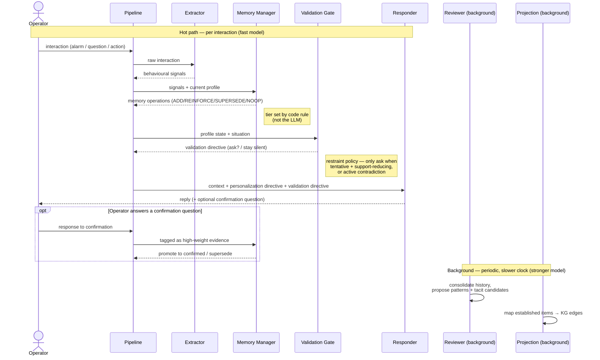

Here's the consolidated picture — the agent roster with scoped responsibilities, the deterministic glue around them, and how it all flows.

## The agents (LLM-driven reasoning components)

**Extractor** — *hot path, fast/cheap model.* Takes one raw operator interaction and emits typed behavioural signals (modality requested, escalation behaviour, troubleshooting actions, confidence indicators). Pure perception: "what behavioural facts does this event contain?" Structured output, no memory awareness, no decisions about what to *do* with the signals.

**Memory Manager** — *hot path, fast/cheap model.* Takes the new signals plus the operator's current active memory and decides, per signal, among ADD / REINFORCE / SUPERSEDE / NOOP. This is the belief-update reasoning — the one place contradiction handling lives. It writes operations to the append-only log; it does **not** set confidence tiers (the code rule does that from evidence counts). When the pipeline tags an incoming message as a response to a confirmation prompt, the Memory Manager treats it as high-weight evidence (promotes to `confirmed` or supersedes).

**Responder** — *hot path, fast/cheap model.* The single operator-facing voice (your "lead agent"). Takes the assembled context bundle (relevant profile slice + KG neighborhood) plus the personalization directive and any validation directive, and produces the reply. It generates wording; it does not decide policy or gather its own context. When asked to validate, it weaves the confirmation question naturally into its response.

**Reviewer** — *background/batch, stronger model.* The reflection organ. Runs periodically over accumulated SQL history to (a) consolidate raw interactions into higher-level patterns, (b) surface candidate tacit-knowledge / novel patterns from the work-as-done vs work-as-imagined gap, and (c) perform conformance comparison on events that were routed to it as SOP-evaluable. It **proposes**; it never promotes — evidence rules and the (designed-not-built) expert gate dispose. Stronger model because it runs rarely and its output quality compounds into the KG.

## The deterministic glue (NOT agents — pipeline code, functions, policies)

These are the components that make the system capable without adding LLMs, and naming them is the design's spine:

- **Pipeline** (`pipeline.py`) — the real entrypoint. Fixed control flow per interaction; no routing LLM.
- **Context Assembler** — given the event, runs fixed KG queries (alarm → procedure, skills, modalities, related alarms) and the profile fold, returns a context bundle. Deterministic in Stage 1.
- **Validation Gate** — the mixed-initiative restraint policy: decides whether to solicit confirmation this turn (only when an item is tentative *and* about to drive support-reduction, or there's an active contradiction). Emits a validation directive into the Responder.
- **Tier Rule** — pure function, evidence_count → status (tentative/established/confirmed).
- **Personalization/Render** — active memory → rendered prompt block + directive; confidence-gated, asymmetric toward support.
- **Conformance Router** — deterministic check: does this event have an alarm with a known SOP? Only evaluable events go to the Reviewer.
- **Projection** — background step mapping `established` free-text items → canonical KG edges against the closed vocabulary (deterministic lookup, not the strong model unless needed).
- **Outcome Resolver** — scheduled function; waits out the outcome window, fills `outcome_quality`/`quadrant`, routes divergent+good-outcome events to expert review.

## Deferred (designed in Task 1, not built in Stage 1)

Tutor (training curriculum from validated struggles), the expert-validation UI, the agentic troubleshooting loop (where the Responder + Context Assembler *become* iteratively agentic), and recency-decay weighting on the fold.

A couple of things the sequence view makes clearer than the flowchart did:

The **confirmation loop** is the interesting bit of timing — it's not a one-shot. The Responder *asks*, then the operator's answer re-enters through the **same** pipeline on the next turn and gets routed to the Memory Manager as high-weight evidence. That's the round-trip that makes `confirmed` reachable and is your "how memory is corrected" mechanism in motion. Showing it as an `opt` block emphasizes it only happens when the Validation Gate fired on a prior turn.

The **background lane is detached** — no arrows crossing into the hot path during an interaction. That separation is deliberate and worth pointing at in the write-up: consolidation and projection run on their own clock and never block the operator-facing response. The hot path stays fast; the slow reasoning happens out of band.

One thing I collapsed for readability: the Validation Gate and the render/personalization step both feed the Responder, so I folded "render personalization directive" into the single `PIPE->>RESP` message rather than drawing it as a separate participant. If you'd rather show personalization rendering as its own lifeline (to emphasize it's a distinct deterministic step), say so and I'll split it back out.

Blue = the four agents, grey = deterministic glue, tan = stores. The thing the diagram is meant to make obvious to a reviewer: the operator talks to **one voice** (the Responder), the hot path runs **three small agents** plus deterministic policy, and all the open-ended reasoning is concentrated in the **one background Reviewer** running on a slower clock against a better model. The ratio of grey to blue is the point — most of the system is inspectable, deterministic structure, and the LLMs are confined to the few places where the path is genuinely uncertain.

One thing to confirm before you lock it: in Stage 1, are you running the background lane (Reviewer/Projection/Outcome) on a real scheduler, or just invoking it manually between demo sessions? For the demo I'd do the latter — a `run_consolidation()` you call explicitly — so you can show "here's the profile after the batch pass" without standing up a scheduler. Worth deciding now because it affects how `scripts/demo.py` is structured.